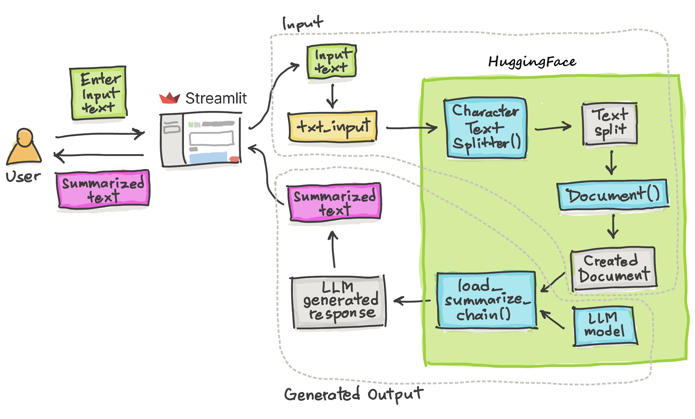

# SummariX
📝 SummariX is a Multilingual Text Summarizer application that summarizes text, PDFs, and images in multiple languages using large language model (LLM) and Langchain framework. We used a pre-trained T5 model and its tokenizer from Hugging Face Transformers library and more hugging face summerization models API.

## Features

- Summarize text input directly
- Summarize content from uploaded PDF, TXT, and image files
- Detect and handle multiple languages
- Translate summarized text to English
- Chat-like prompt system for refining summaries
- User can select the sigle or multiple models according to choice
- Display tokens used and word count of summary generated

## Architecture of the app




## Demo

You can try the live demo on [Try SummariX](https://summarix.streamlit.app/).

## LLM Models used
We used below Hugging Face open source models which are specifice to text summarization.
1. facebook/bart-large-cnn
2. meta-llama/Llama-3.1-405B
3. google/pegasus-xsum
4. distilbart-cnn-12-6
5. bart-large-cnn-samsum
6. google/pegasus-cnn_dailymail
7. T5 transformer Model


## Installation

### Local Setup

1. **Clone the repository:**

    ```sh
    git clone https://github.com/prakashgore/SummariX.git
    cd SummariX
    ```

2. **Create and activate a virtual environment:**

    ```sh
    python -m venv myenv
    source myenv/bin/activate   # On Windows use `myenv\Scripts\activate`
    ```

3. **Install dependencies:**

    ```sh
    pip install -r requirements.txt
    ```

4. **Run the Streamlit app:**

    ```sh
    streamlit run app.py
    ```


## Usage

1. **Navigate to the app URL [Try SummariX](https://summarix.streamlit.app/).**
2. **Choose an input method:**
    - Direct Text Input
    - Upload File (PDF, TXT, Image)
3. **Enter or upload your content.**
4. **Optionally add prompts to refine the summary.**
5. **Click "Generate Summary" to get the summarized text.**

## License

This project is licensed under the MIT License - see the [LICENSE](LICENSE) file for details.

## Acknowledgments

- [Streamlit](https://streamlit.io)
- [Hugging Face](https://huggingface.co)


